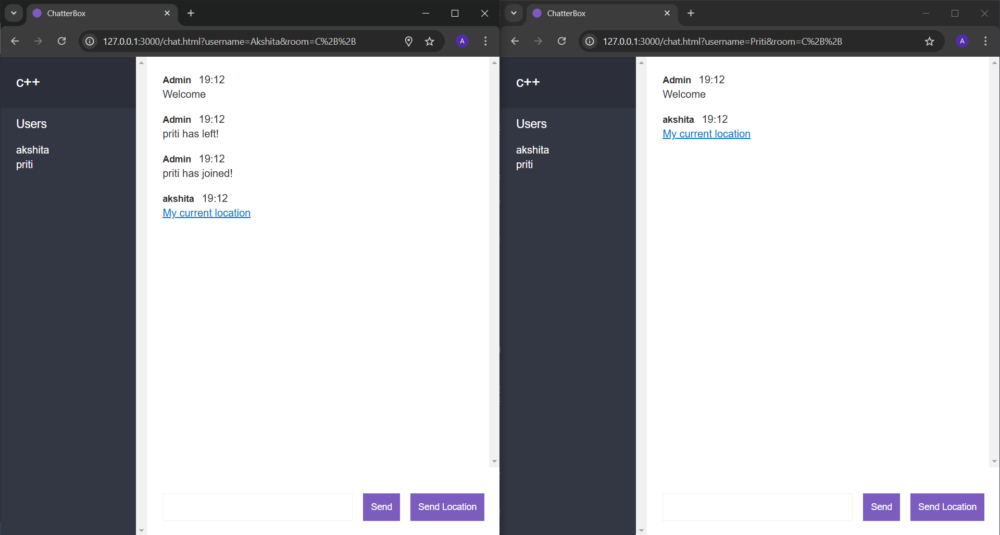

# ChatterBox

ChatterBox is a real-time chat application built using Node.js and Socket.io for the server-side functionality. It allows users to engage in live, interactive conversations through a simple and intuitive interface.

## Features

1. Real-time Chat: Users can send and receive messages instantly within a simple, intuitive chat interface.

2. Chat Rooms: Create and join multiple chat rooms, allowing users to engage in group conversations around specific topics or interests.

3. Location Sharing: Users can share their location in the chat, enabling others to view their current geographical position on a map.

4. Responsive Design: Optimized for use across devices (desktop, tablet, mobile) for seamless video chatting.

5. User-friendly Interface: Simple and intuitive UI for easy navigation and smooth user experience.


## Snapshot




## Run Locally

Clone the project

```bash
  git clone https://github.com/gupta03akshita/ChatterBox.git
```

Go to the project directory

```bash
  cd <Project Folder>
```

Install dependencies 

```bash
  npm install
```

Start the application

```bash
  npm run dev
```

